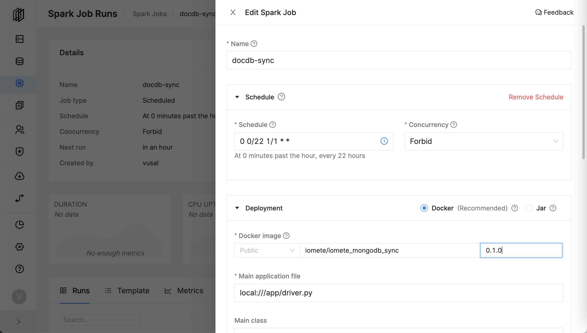
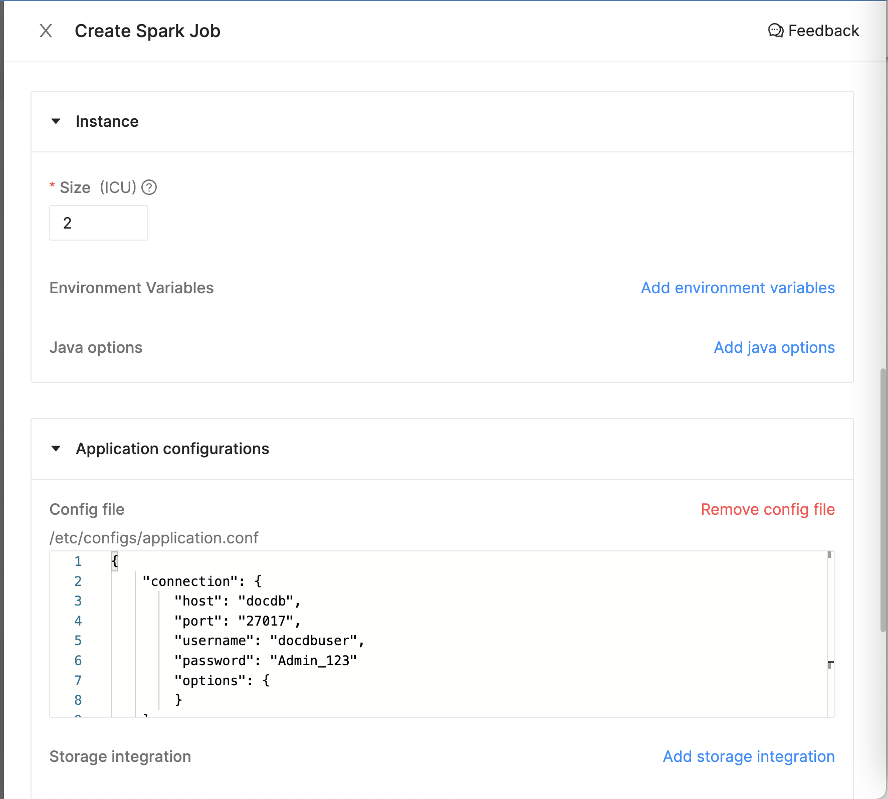
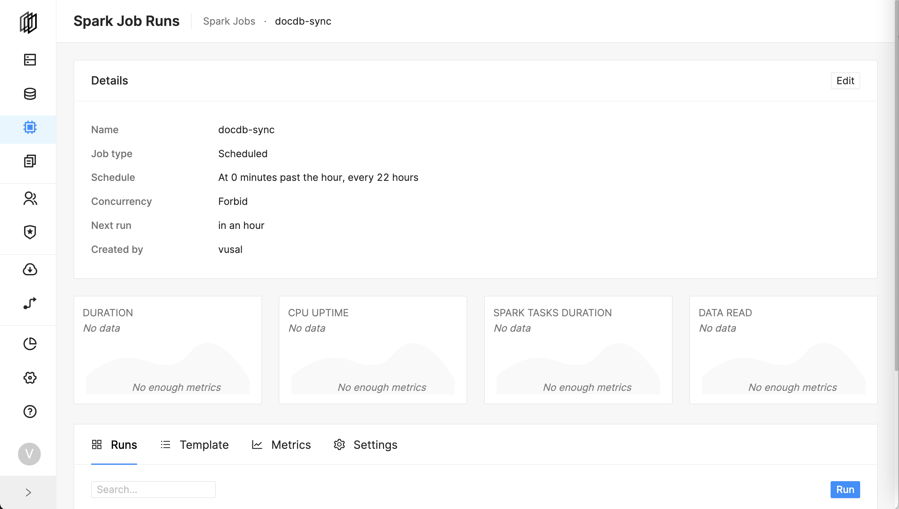

# iomete: Pyspark mongodb sync


## Deployment


> Note: Before deploying, make sure you have the following:
> - Manually create a target database. In this example, it's `docdb_raw`
> - Setup SSH Tunnel to your DocumentDB or MongoDB server

- Go to `Spark Jobs`.
- Click on `Create New`.

Specify the following parameters (these are examples, you can change them based on your preference):
- **Name:** `docdb-sync`
- **Schedule:** `0 0/22 1/1 * *`
- **Docker Image:** `iomete/iomete_mongodb_sync:0.1.0`
- **Main application file:** `local:///app/driver.py`
- **Config file:** 
```hocon
{
    "connection": {
        "host": "docdb",
        "port": "27017",
        "username": "docdbuser",
        "password": "Admin_123"
        "options": {
        }
    },
    "syncs": [
        {
            "source_database": "business",
            "source_collections": [ "restaurants"]
            "destination_schema": "docdb_raw"
        }
    ]
}
```

Create Spark Job


Create Spark Job - Application Config


And, hit the create button.

---
The job will be run based on the defined schedule. But, you can trigger the job manually by clicking on the `Run` button.




## Development

**Prepare the dev environment**

```shell
virtualenv .env #or python3 -m venv .env
source .env/bin/activate

pip install -e ."[dev]"
```

**Run test**

```shell
pytest
```
